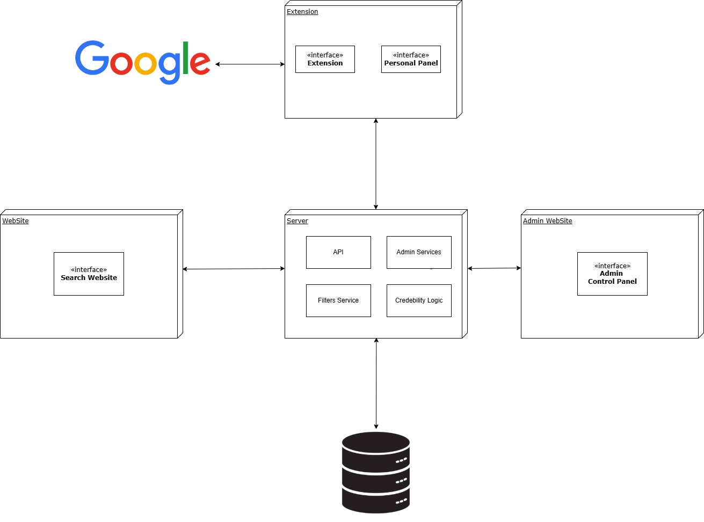

# Project Description

## Brief Overview of the Project

In the digital age, the rise of AI-driven bots on social media has made it increasingly difficult to distinguish between real and automated interactions. Bots are often used to spread misinformation, manipulate discussions, and create artificial engagement, threatening the authenticity of online spaces.

Our project, **BotBlocker**, aims to address this issue by developing a **browser extension and website** that enables users to **identify, flag, and block AI-operated accounts in real time**. Inspired by the **Dead Internet Theory**, which suggests that much of the online content we consume may be artificially generated, our solution leverages a **community-driven evaluation system** to enhance transparency and combat online manipulation.

## Key Features

- **Real-time bot detection** through a browser extension.
- **Personalized blocking** of flagged AI-operated accounts to minimize unwanted interactions.
- **Community-based voting system** with a simple ‘Yes’ or ‘No’ mechanism, supported by user comments.
- **A credibility scoring algorithm** that weighs votes based on user trustworthiness.
- **A user-friendly website** for analyzing social media profiles, viewing evaluation history, and managing blocked accounts.
- **Integration with authentication systems** to ensure reliable votes and prevent abuse.

By combining **collective intelligence** with **advanced bot detection**, BotBlocker empowers users to **take back control of their online experience**, ensuring that social media remains a **trustworthy and authentic space** for real interactions.

## Project Architecture

The system architecture consists of three main interfaces: a browser extension, a website, and an admin interface. The extension serves as an account blocker, allowing users to set filters, block, and evaluate accounts. The website provides a platform to search profiles, view evaluations, and track user activity. The admin interface is used for managing, controlling, and monitoring evaluations. These interfaces are connected to a backend responsible for credibility calculations, custom search filters, and account management. The database stores information on accounts, evaluations, and user preferences, with authentication available via Google.