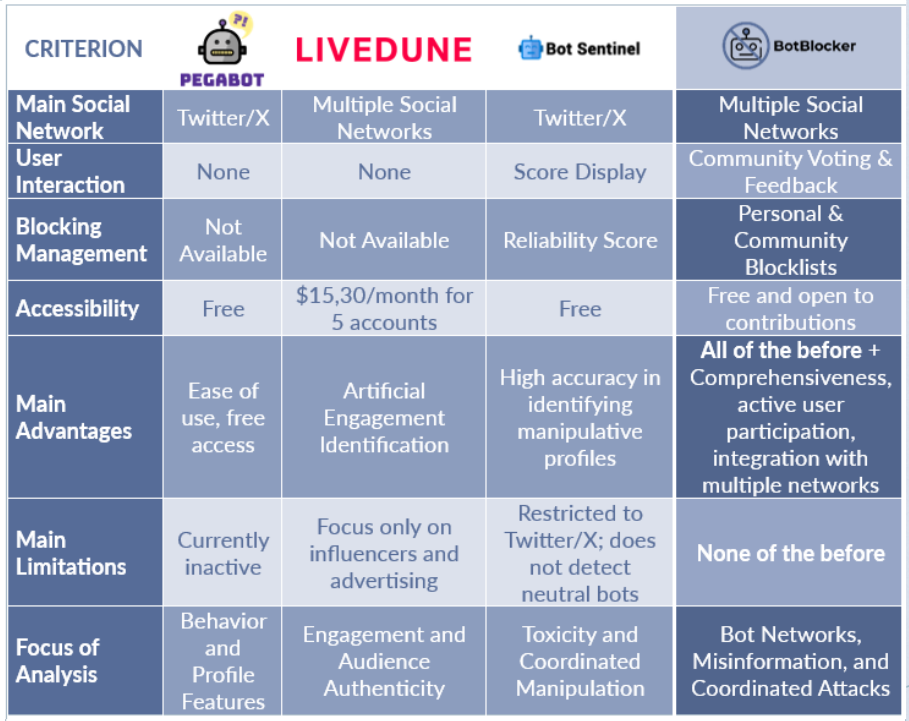
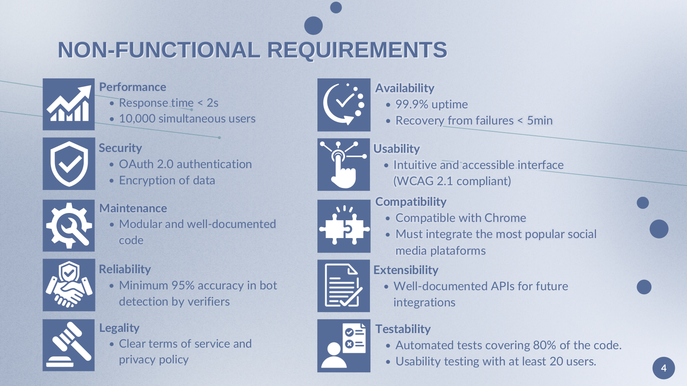
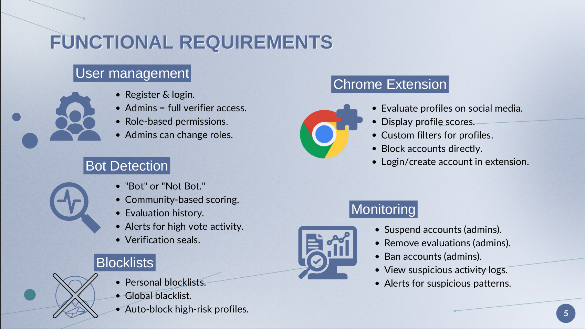
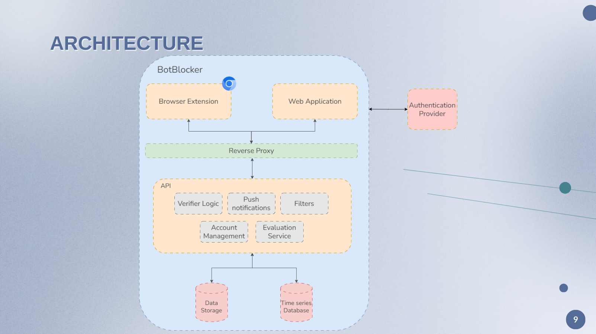

# BotBlocker Elaboration Phase: Requirements, Architecture, and Design

## State of the Art

### 1. The Problem

Social networks face a growing threat from malicious bots, which manipulate interactions, spread misinformation, and influence politics and economies. Studies show 9-15% of active Twitter/X users are bots, with 8.5% confirmed as automated. As bots become more sophisticated with AI, detecting them is increasingly challenging, threatening the authenticity of online spaces.

### 2. Impact of Bots

Bots distort public opinion, interfere in elections, and manipulate financial markets. For example, during the 2016 U.S. elections, 20% of Twitter interactions were bot-generated. They also pose cybersecurity risks, such as identity theft and phishing, by cloning real profiles or infiltrating organizations. Their ability to mimic human behavior makes them a persistent threat.

### 3. Our Solution: Bot Blocker

Bot Blocker combines AI, community participation, and human supervision to detect and block bots. It features a community voting system, personalized blocklists, and hierarchical verification to reduce false positives. By integrating advanced technology with collective intelligence, Bot Blocker aims to create a safer, more authentic online environment across multiple social networks.

# Requirements

### Non-functional requirements:

### Functional requirements:

# System Architecture
The BotBlocker system follows a modular architecture, integrating a browser extension and a web application for bot detection and filtering.
Core Components:

- **Client-Side:** A browser extension for real-time profile analysis and a web app for managing evaluations and accounts.
- **Backend API:** Handles verification logic, push notifications, filters, account management, and bot evaluations.
- **Reverse Proxy:** Ensures security and load balancing between client applications and backend services.
- **Databases:** A data storage system for user preferences and bot evaluations, plus a time-series database for tracking bot activity.
- **Authentication Provider:** Manages secure user authentication and role-based access.

This architecture ensures a scalable, secure, and efficient bot detection system.

# Use Cases
- **Profile Evaluation**

Authenticated users can classify profiles as "Bot" or "Not Bot," contributing to a community-based scoring system. Verifiers and administrators can apply verification badges to highlight trusted or suspicious profiles.
- **Managing Suspicious Profiles**

Users can manually block unwanted profiles, ensuring they do not appear in their feed. Additionally, they can customize filters within the extension to automatically hide profiles based on suspicion scores and verification status.
- **Monitoring Suspicious Activity**

Administrators and verifiers receive alerts about unusual patterns, such as spam voting. If abuse is confirmed, they can apply temporary or permanent suspensions to prevent system manipulation.
- **Quick Profile Verification via Extension**

The extension allows users to quickly analyze suspicious profiles directly on social media, displaying the profile’s score and verification status.

For a detailed description of all use cases, please refer to the [**Use Cases**](/pdfs/MS2/useCases.pdf) document.

# Mockups

import PdfViewer from '@site/src/components/PdfViewer';

<PdfViewer src="/Documentation/pdfs/MS2/Mockups.pdf" />

