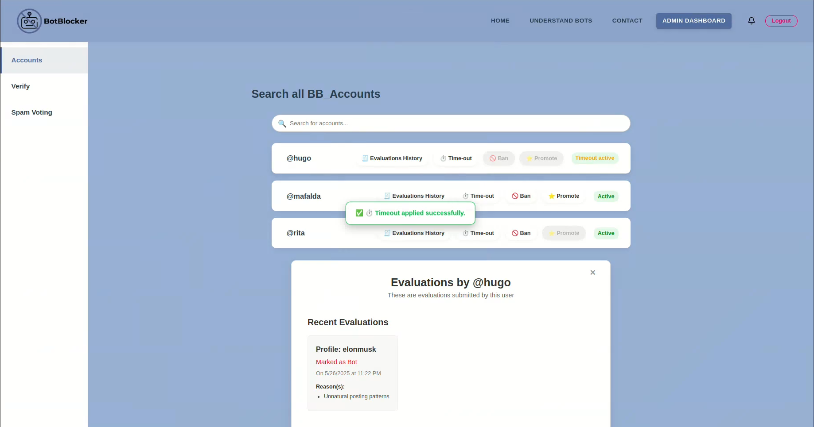
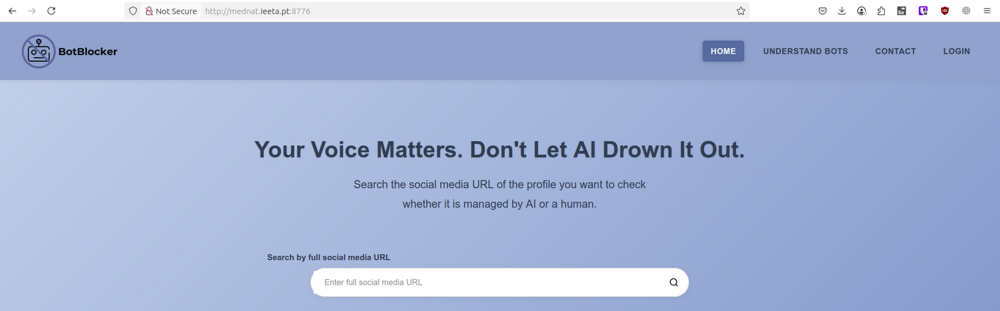
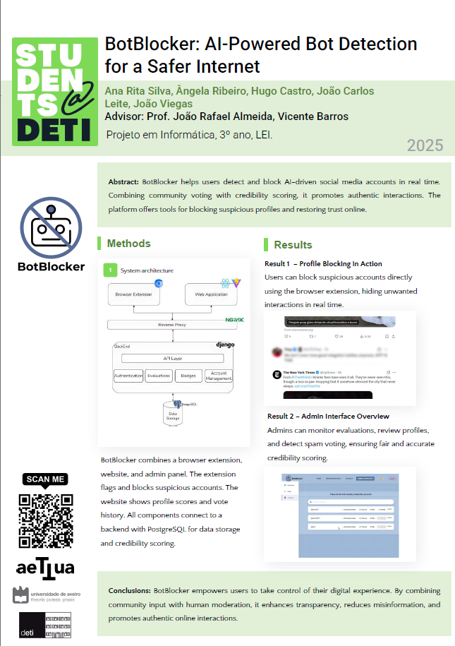

During Milestone 4, the BotBlocker project reached its final and most complete stage. Building on the foundations developed in earlier milestones, this phase focused on finalizing all core functionalities, ensuring system stability, and preparing for public demonstration.

### Finalization of Admin Functionality

A key highlight of this milestone was the full implementation of the **Admin Dashboard**, including real-time monitoring and moderation capabilities. Admin users can now:

- Monitor **anomalous behavior** (e.g., spam voting, coordinated attacks) in real-time;
- Receive alerts via WebSockets when suspicious patterns are detected;
- Apply **timeouts** or **bans** to users directly from the dashboard;
- Track the status of each anomaly (Pending, In Progress, Solved).

### Deployment and Public Availability

The system is now fully deployed and available online:

- The **BotBlocker website** is live, allowing users to evaluate and manage profiles. (http://mednat.ieeta.pt:8776/)
- The **browser extension** is installable via GitHub. (https://github.com/BotBlocker-pi/BotBlocker-Extension)

### Students@DETI Presentation & Materials

As part of the final project showcase, the team:

- Created a **poster** summarizing the problem, solution, architecture, and main features;
- Recorded a **promotional video** that promotes the project;
- Repeatedly performed a **live demo** of the BotBlocker system, showcasing its functionalities and user interface;
- Ensured repositories were clean, public, and included full documentation.

All public materials (poster, source code, videos) are fully included in either the repository or documentation website.

### Usability Testing & Improvements

A full **usability study** was conducted with 11 participants across 3 user types:

- Regular users
- Technical users
- Low digital literacy users

Each participant completed structured tasks and submitted feedback through SUS questionnaires and observer-monitored forms. Based on their input, the following improvements were implemented:

- Tooltips were added;
- Admin/verifier actions include confirmation modals;
- The user interface was simplified for low digital literacy users;
- Icons and labels were added/clarified for better understanding;

import PdfViewer from '@site/src/components/PdfViewer';

<PdfViewer src="/Documentation/pdfs/MS4/usabilityAndSUS.pdf" />

### Report and Final Functionalities

The BotBlocker project culminated in the delivery of the technical report, which outlines the development process, the technical decisions, and the final implementations. This report is structured to provide clarity on the project's architecture, the role-based access control (RBAC) system, the specific use cases, and the necessary non-functional requirements for the system's robustness and scalability.

The report, available in the repository, provides detailed descriptions of these features, the system architecture, and the design decisions behind each implementation. This comprehensive documentation serves as a technical guide for future developers and as an overview for stakeholders, providing transparency into the community-driven approach to bot detection and filtering.

<PdfViewer src="/Documentation/pdfs/MS4/report.pdf" />

### Final Repository Cleanup

To conclude the project:

- All code was cleaned, documented, and tagged;
- Issues and project boards on GitHub were closed or archived;
- The repository was organized to ensure clarity and ease of navigation for future developers;

---

With this milestone, the BotBlocker system is fully functional, publicly accessible, and backed by real user feedback and rigorous testing. The project now stands as a deployable, community-powered solution to the growing issue of AI-driven bots on social media.
